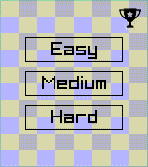

# Minesweeper

_Powered by [raylib](https://github.com/raysan5/raylib)_



## Installation

### Cmake

```
cmake -B build -DCMAKE_BUILD_TYPE=Release
cmake --build build --config Release
```

#### For MinGW

```
cmake -B build -DCMAKE_BUILD_TYPE=Release -G "MinGW Makefiles"
cmake --build build --config Release
```

### Make

(Use it only if `raylib 5.0` already installed)

```
make clean
make release
```

---

You can run build in parallel with `-j` option like this:

```
make clean
make release -j 4
```

```
cmake -B build -DCMAKE_BUILD_TYPE=Release
cmake --build build --config Release -j 4
```

where 4 is the number of concurrent processes to use when building.

---

Binary `minesweeper` will be located in the root directory of the project.


## Changelog

- **v0.2.1**
    - added hoverable buttons
    - fixed minimum size of window when entering main menu
- **v0.2.0**
    - added main menu
- **v0.1.2**
    - added clickface
    - fixed min window size on windows
    - fixed bug when clicking around the grid
- **v0.1.1**
    - added mines generation after first click
    - added ability to start new game in the middle of current one
    - added setting cells down when mouse left key down
    - fixed the display of negative numbers
- **v0.1.0**
    - First bad version
